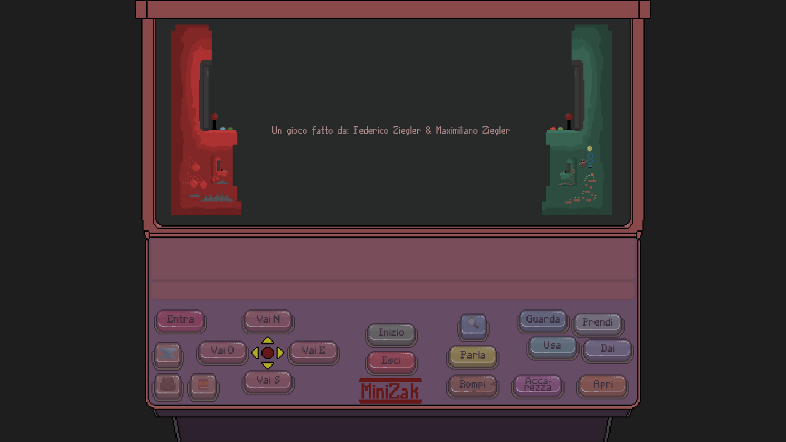

# Minizak-Text-AdventureGame
Me and my brother Max made a game in 3 months some time ago as a project that we delivered to our teacher Roberto Navigli for an axam of computer science called "Metodologie di Programmazione" at la "Sapienza" in Rome, it was a lot of fun and also a lot of work, all the art was made by me and the code was written by both me and my brother.

The game was made starting with a text engine made completely from scratch and then was merged with javafx.
We used java with java-fx library and worked with multiple threads to make it work one for the graphic part and one for the text engine part.

The game was and still is fully playable in italian language but it hasn't been released yet. We are planning to release it at some point of our lives when we'll have more time to change it to the english version and add the sounds for it.

This repository contains some of the classes we used to make it possible and some of the images that show the actual gameplay.

The code that is shown it's far from perfect but we are still proud of the work we did, accounting to the limited knowledge and time we had learning java.

